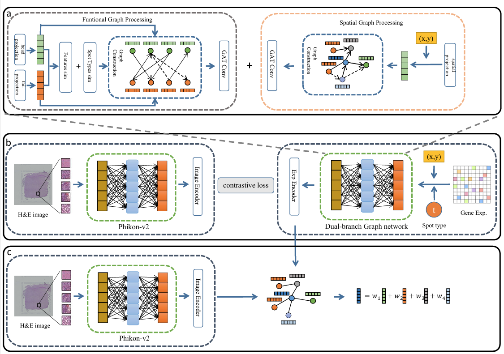

# GR2ST: Spatial Transcriptomics Prediction based on Graph-Enhanced Multimodal Contrastive Learning

## Overview
Here, we propose GR2ST, a deep learning model that learns the underlying connections between image features and gene expression to predict spatial transcriptomics. GR2ST employs a large pre-trained model for the purpose of image feature extraction; a dual-branch graph neural network captures functional similarity and spatial proximity in gene expression by incorporating spatial coordinates and cell-type annotations. Contrastive learning then narrows the discrepancy separating image features from gene expression representations. Finally, we use the image features aligned by GR2ST to predict gene expression. We evaluated the performance of the model on datasets from cutaneous squamous cell carcinoma and human breast cancer to demonstrate its effectiveness.

## System environment
Required package:
- PyTorch >= 2.1.0
- scanpy >= 1.8
- python >=3.9

## Datasets
Two publicly available ST datasets were used in this study. You can find them on the following websites：
-  human HER2-positive breast tumor ST data from https://github.com/almaan/her2st/.
-  human cutaneous squamous cell carcinoma 10x Visium data from GSE144240.

## Baseline
You can obtain the baseline used in this article from the following link.
- HisToGene: https://github.com/maxpmx/HisToGene
- Hist2ST: https://github.com/biomed-AI/Hist2ST
- THItoGene: https://github.com/yrjia1015/THItoGene
- HGGEP: https://github.com/QSong-github/HGGEP
- mclSTExp: https://github.com/shizhiceng/mclSTExp
- Reg2ST: https://github.com/Holly-Wang/Reg2ST

## GR2ST pipeline

- Run `hvg_her2st.py` generation of highly variable genes.
- Run `data_precessing.ipynb` 
- Run `train_her2st.ipynb`
- Run `evel_her2st.py`

## Results

\begin{table}[!t]
\caption{Wilcoxon signed-rank test results and PCC results on HER2+ dataset\label{tab1}}%
\centering
\begin{tabular}{ccccc}
\toprule
\multirow{2}{*}{Model}&\multirow{2}{*}{PCC}&Median&Wilcoxon&Significance\\
&&diff&P-value&($\alpha$=0.05)\\
\midrule
GR2ST & 0.2340  & -  & - & -  \\
HisToGene & 0.0818  & 0.1399 & 0.0000 & Yes  \\
THItoGene & 0.1330  & 0.0969 & 0.0000 & Yes  \\
Hist2ST & 0.1484  & 0.0916 & 0.0000 & Yes  \\
HGGEP & 0.1566  & 0.0891 & 0.0000 & Yes  \\
mclSTExp & 0.2281  & 0.0049 & 0.0401 & Yes  \\
Reg2ST & 0.1741  & 0.0628 & 0.0000 & Yes  \\
\botrule
\end{tabular}
\end{table}

\begin{table}[!t]
\caption{Wilcoxon signed-rank test results and PCC results on cSCC dataset\label{tab2}}%
\centering
\begin{tabular}{ccccc}
\toprule
\multirow{2}{*}{Model}&\multirow{2}{*}{PCC}&Median&Wilcoxon&Significance\\
&&diff&P-value&($\alpha$=0.05)\\
\midrule
GR2ST & 0.3246  & -  & - & -  \\
HisToGene & 0.0771  & 0.2509 & 0.0002 & Yes  \\
THItoGene & 0.1796  & 0.1586 & 0.0002 & Yes  \\
Hist2ST & 0.1749  & 0.1428 & 0.0002 & Yes  \\
HGGEP & 0.1084  & 0.2041 & 0.0002 & Yes  \\
mclSTExp & 0.3157  & 0.0049 & 0.1018 & No  \\
Reg2ST & 0.2024  & 0.1348 & 0.0002 & Yes  \\
\botrule
\end{tabular}
\end{table}
</code>
</pre>
