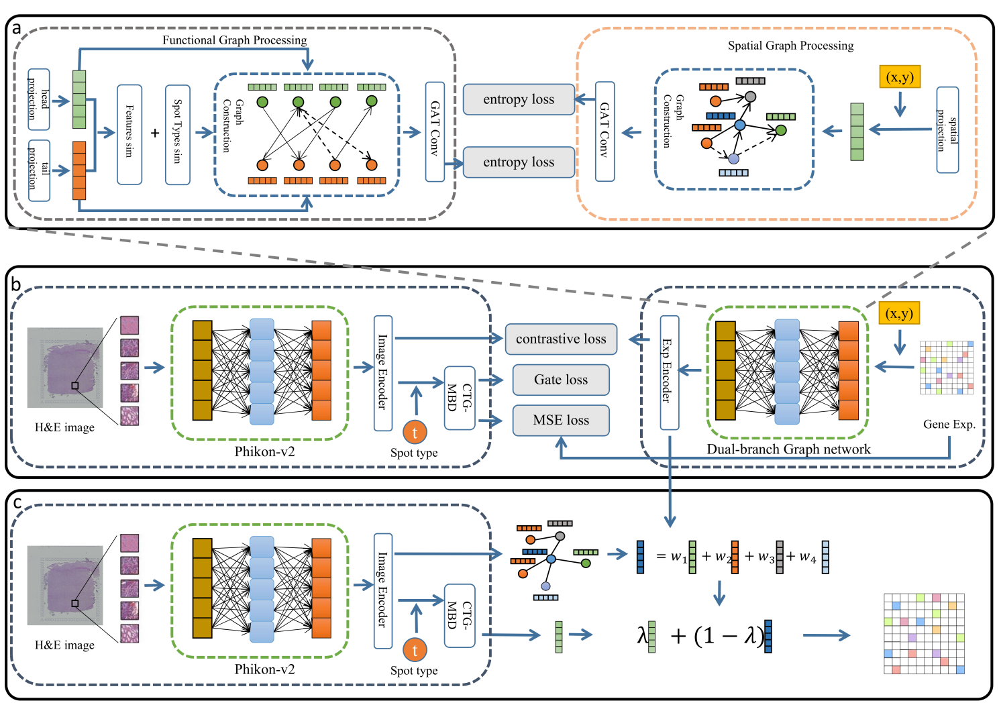

# GR2ST: Spatial Transcriptomics Prediction based on Graph-Enhanced Multimodal Contrastive Learning

## Overview
GR2ST leverages a large pre-trained pathology model to extract high-level histological features. We designed a dual-branch graph architecture, consisting of a dynamic threshold-based functional graph and a radius-constrained spatial graph, to capture complex spot interactions within heterogeneous tissues. The model aligns histology images with gene expression representations through a multimodal contrastive learning framework. It achieves adaptive gene expression generation via a Cell-Type Guided Multi-Branch Regression Head supervised by a context-aware weighting network, which is further integrated with cross-sample retrieval to construct an ensemble prediction. The performance of the model is evaluated on three cancer-related spatial transcriptomics datasets, including cutaneous squamous cell carcinoma and two human breast cancer cohorts, to demonstrate its effectiveness and robustness.

## System environment
Required package:
- PyTorch >= 2.1.0
- scanpy >= 1.8
- python >=3.9

## Datasets
Two publicly available ST datasets were used in this study. You can find them on the following websites：
-  human HER2-positive breast tumor ST data from https://github.com/almaan/her2st/.
-  human cutaneous squamous cell carcinoma 10x Visium data from GSE144240.
-  Swarbrick’s Laboratory Visium data from https://doi.org/10.48610/4fb74a9.

## Baseline
You can obtain the baseline used in this article from the following link.
- HisToGene: https://github.com/maxpmx/HisToGene
- Hist2ST: https://github.com/biomed-AI/Hist2ST
- THItoGene: https://github.com/yrjia1015/THItoGene
- HGGEP: https://github.com/QSong-github/HGGEP
- mclSTExp: https://github.com/shizhiceng/mclSTExp
- Reg2ST: https://github.com/Holly-Wang/Reg2ST
- STMCL: https://github.com/wenwenmin/STMCL

## GR2ST pipeline

- Run `hvg_her2st.py` generation of highly variable genes.
- Run `data_precessing.ipynb` to obtain the various data required for model training.
- Run `train_her2st.ipynb` to train the model on the her2st dataset using leave-one-out cross-validation.
- Run `evel_her2st.py` to calculate the PCC between predicted and ground truth gene expression to evaluate model performance.

## Results

| Model       | PCC (HER2+) | PCC (cSCC) | PCC (Alex) |
|-------------|------------------|------------------|
| HisToGene   | 0.0818           | 0.0771           | 0.0392           |
| Hist2ST     | 0.1484           | 0.1749           | 0.0712           |
| THIToGene   | 0.1330           | 0.1796           | 0.0638           |
| mclSTExp    | 0.2281           | 0.3157           | 0.0778           |
| HGGEP       | 0.1566           | 0.1084           | 0.0751           |
| Reg2ST      | 0.1741           | 0.2024           | 0.0834           |
| STMCL       | 0.1741           | 0.2024           | 0.0905           |
| GR2ST       | **0.2357**           |  **0.3288**      |  **0.1130**  |

Reuslts of ablation study and parameter sensitivity are in folder `results`.
</code>
</pre>
